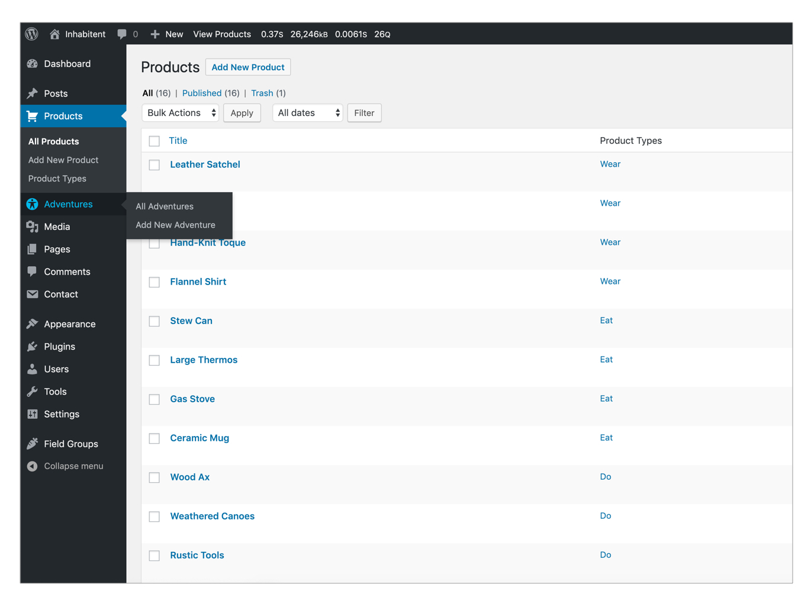

# Inhabitent Wordpress Theme

A multi-page website with a blog for a camping supply company called Inhabitent Camping Supply Co. using WordPress as a content management system.


[](https://www.php.net/)
[](https://www.mysql.com/)
[](https://wordpress.org/)

[](https://github.com/gulpjs/gulp)
[](https://github.com/dlmanning/gulp-sass)
[](https://jquery.com/)


[](https://github.com/BrowserSync/browser-sync)
[](https://github.com/sindresorhus/gulp-autoprefixer)
[](https://github.com/ben-eb/gulp-cssnano)
[](https://github.com/adametry/gulp-eslint)
[](https://github.com/andidittrich/gulp-prettyerror)
[](https://github.com/hparra/gulp-rename)
[](https://github.com/duan602728596/gulp-terser)

[](https://wordpress.org/plugins/contact-form-7/)
[](https://wordpress.org/plugins/custom-field-suite/)
[](https://wordpress.org/plugins/debug-bar/)
[](https://wordpress.org/plugins/query-monitor/)
[](https://wordpress.org/plugins/show-current-template/)
[](https://wordpress.org/plugins/theme-check/)

[](https://github.com/yongmin86k/Inhabitent-Site-Project/)
[](https://github.com/yongmin86k/Inhabitent-Site-Project/)

[](https://lbesson.mit-license.org/)
 

---
 
## Wordpress Theme Template hierarchy

Each of theme templates is used to display the best designs and layouts of the page.

 

**1. Menu**

|[Home] `front-page.php`|[Shop] `archive-product.php`|[Journal] `home.php`|[About] `page-about.php`|[Find us] `page.php`|
---|---|---|---|---
| **header-front-page.php** |header.php |header.php |**header-full-width.php** |**header-full-width.php** |
| template-parts/content.php |footer.php |sidebar.php |footer.php |sidebar.php |
| footer.php | | footer.php | |footer.php |

 

**2. Other pages**

|`single-product.php`|`taxonomy-product-type.php`|`single.php`|`single-adventure.php`|
---|---|---|---
|header.php|header.php|header.php|header-adventure.php|
|template-parts/content-buttons.php|footer.php|template-parts/content-single.php|template-parts/content-buttons.php|
|footer.php| |sidebar.php|footer.php|
| | |footer.php| |
 

---
 
## Features

**1. Custon Loops**
- 3 Types of custom loops are used : 
    - `get_terms( $query )` - is used in *front-page.php* to display SHOP STUFF and used in *archive-products.php* to display categories
    - `get_posts( $query )` - is used in *front-page.php* to display INHABITENT JOURNAL, LATEST ADVENTURES
    - `new WP_Query( $query )` - is used in *archive-product.php* to display products

 

**2. Theme Plugins**
- **Business hours widget**
    
    Create custom widgets in the sidebar for **contact info** and **business hours** to change information easily.

    

- **Inhabitent functionality**

    Add custom posts menu in the admin menu.

    


 

**3. Customize codes in functions.php & inc/extra.php**
- WordPress Hooks are a way for one piece of code to interact/modify another piece of code. They make up the foundation for how plugins and themes interact with WordPress Core, but they’re also used extensively by Core itself.

- **Actions**

    1. Disable editing theme and plugin files in Admin menu
        ```php
        function inhabitent_remove_submenus() {
            remove_submenu_page( 'themes.php', 'theme-editor.php' );
            remove_submenu_page( 'plugins.php', 'plugin-editor.php' );
        }
        
        add_action( 'admin_menu', 'inhabitent_remove_submenus', 110 );
        ```
         
    2. Add custom logo in the log-in screen
        ```php
            function inhabitent_custom_login() {
                echo '<style type="text/css">
                    #login h1 a { 
                        background-image:url('.get_stylesheet_directory_uri().'/images/logos/inhabitent-logo-text-dark.svg);
                        background-size: contain;
                        width: 100%;
                        margin: 0;
                    }
                </style>';
            }
            add_action('login_head', 'inhabitent_custom_login');
        ```
        &nbsp;

- **Filters**

    1. Modify the link of the logo in the log-in screen
        ```php
        function inhabitent_custom_login_url() {
            return get_bloginfo( 'url' );
        }
        add_filter( 'login_headerurl', 'inhabitent_custom_login_url' );
        ```


&nbsp;

---
&nbsp;
## License
- Structural code is open-sourced under the [MIT license](/LICENSE.md). 
&nbsp;

- Learning materials content is copyright (c) 2019 RED Academy.

<3